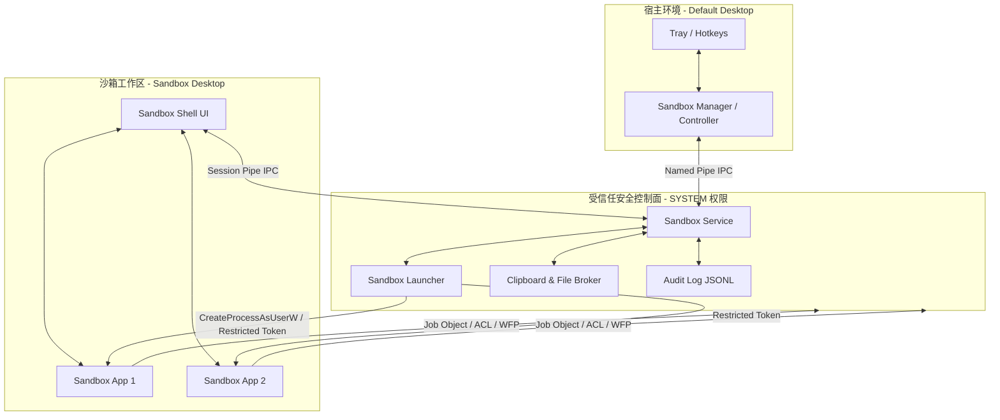

# Sandbox+ (Sandbox Plus)

Sandbox+ 是一款面向 Windows 本机场景的轻量级工作区沙箱隔离系统。

不同于传统的完整虚拟机（如 Hyper-V VM）或 RDP 远程桌面方案，Sandbox+ 旨在不引入虚拟机镜像、不破坏 Windows Shell 的前提下，为用户提供一个可进入、可退出、安全受控、用户边界清晰的**本机沙箱工作区**。

---

## 核心设计理念

1. **轻量与快速**：默认采用本机沙箱工作区隔离，启动速度与普通 Windows 应用无异，不依赖 Hyper-V 虚拟机或本地远程桌面（localhost RDP）。
2. **多层安全边界**：结合 Windows Desktop 对象、受限 Token、独立 Profile 环境变量、ACL 文件权限控制、WFP（Windows Filtering Platform）网络过滤以及 Job Object 进程树监管，实现纵深防御。
3. **原生交互体验**：提供独立的交互桌面（`WinSta0\Sandbox-{id}`）与定制的工作区 Shell（Sandbox Shell），实现原生窗口分组和视觉隔离，保证沙箱应用与宿主应用窗口互不干扰。
4. **安全决策集中化**：UI 层（Controller/Shell）仅负责交互，所有高权限的安全策略（网络、文件 ACL、Token 创建、审计）均由后台受信任的系统服务（`sandbox-service`）统一管理和决策（Fail-closed 模式）。

---

## 系统架构分层



---

## 模块结构 (Crate Workspace)

本工程是一个 Rust 工作区，包含了底层的系统调用、隔离核心以及上层的控制和演示组件：

| Crate / 目录 | 职责说明 | 当前状态 |
|:---|:---|:---|
| **`crates/sandbox-service`** | 本地受信任服务主程序，管理沙箱生命周期、策略（JSON）、Profile 准备、Job 挂载、WFP 网络等。 | 已实现 Named Pipe Host、Profile 挂载、Job Object 监管 |
| **`crates/sandbox-manager`** | 宿主会话中的控制器，提供 CLI 命令行、系统托盘、全局热键（`Ctrl+Alt+S`）以及 Desktop 切换能力。 | 已实现 CLI 指令分发、托盘与热键管理 |
| **`crates/sandbox-desktop`** | 封装 Windows Desktop (`WinSta0\Sandbox-*`) 的创建、关闭、切换及定向启动进程的底层 API。 | 已实现核心 Desktop 句柄操作库 |
| **`crates/sandbox-launcher`** | 短生命周期 Helper，负责以 Restricted Token、Integrity Level 及定制环境变量启动沙箱应用。 | 已接入 Token 裁剪与 Integrity 设定边界 |
| **`crates/sandbox-ipc`** | 定义 Service 与 Controller/Shell 之间的 Named Pipe 通信协议与 JSON 序列化消息。 | 已完成通用请求/响应协议枚举 |
| **`crates/sandbox-shell`** | 运行在沙箱桌面环境中的工作区壳，负责展示状态栏、启动白名单应用及任务栏交互。 | 已完成第一版 Win32 原生 Shell 占位实现 |
| **`crates/sandbox-policy`** | 安全策略管理与白名单规则校验库。 | 已实现 JSON 策略加载与应用过滤 |
| **`crates/sandbox-audit`** | 提供统一的 JSONL 格式审计日志接收器，审计沙箱的创建、切换与敏感操作。 | 已完成基础 Audit Sink |
| **`crates/sandbox-net`** | 基于 WFP (Windows Filtering Platform) 的网络隔离模块。 | 已定义 `NetworkEnforcer` 隔离边界 |
| **`crates/sandbox-common`** | 基础类型、系统错误处理（`SandboxError`）与公用工具函数。 | 基础模块 |
| **`crates/sandbox-shell-winui`** | 预留的 WinUI 3 现代化沙箱 Shell 工程（基于 C# / .NET 8.0）。 | 待进一步迭代接入 |
| **`docs/`** | 包含项目技术方案、PoC 验证报告及详细设计规范。 | 完善中 |

---

## 快速开始

### 准备环境
由于 Sandbox+ 涉及 Windows 底层 API（Desktop、Token、Job Object 等），请在 **Windows 操作系统**下开发与运行。
1. 安装 [Rust 编译链](https://rustup.rs/)（使用 `x86_64-pc-windows-msvc`）。
2. （可选，用于 WinUI 3 Shell）安装 [.NET 8.0 SDK](https://dotnet.microsoft.com/download/dotnet/8.0)。

### 编译项目
在项目根目录下，执行 Cargo 命令编译所有 Rust crate：
```powershell
cargo build
```

### 自动化 Smoke 测试
我们提供了一个自动化的 PowerShell 测试脚本，会编译程序、后台拉起 Service、通过 Manager 创建沙箱会话、模拟启动应用并进行生命周期清理：
```powershell
powershell -File scripts/smoke-session.ps1
```

---

## 命令行手动操作指南

你可以通过以下命令手动模拟 Sandbox+ 运行周期：

### 1. 启动沙箱服务
使用高权限（以管理员身份运行）终端启动 `sandbox-service`，并加载策略文件：
```powershell
.\target\debug\sandbox-service.exe run --policy examples\dev-policy.json
```

### 2. 通过 Manager 操作沙箱会话
在普通用户终端中，使用 `sandbox-manager` 与 Service 进行通信：

*   **创建沙箱会话**：
    ```powershell
    cargo run -p sandbox-manager -- create-session S-1-5-21-smoke
    ```
*   **查看当前状态**：
    ```powershell
    cargo run -p sandbox-manager -- status
    ```
*   **查看白名单可启动应用**：
    ```powershell
    cargo run -p sandbox-manager -- list-apps
    ```
*   **在沙箱中启动白名单应用**：
    ```powershell
    cargo run -p sandbox-manager -- launch-app cmd-exit
    ```
*   **列出沙箱内正在运行的进程**：
    ```powershell
    cargo run -p sandbox-manager -- list-processes
    ```
*   **关闭并清理沙箱会话**：
    ```powershell
    cargo run -p sandbox-manager -- close-session
    ```

---

## 安全隔离实现细节

*   **Desktop 交互隔离**：系统通过 `CreateDesktopW` 创建物理隔离的交互式 Desktop 实例，避免沙箱进程与宿主桌面进程进行 Windows 消息挂钩、窗口监视或按键窃取。
*   **Job Object 限制**：会话中创建的每一个进程都会被强制关联至同一个 Windows Job Object。当沙箱会话关闭时，即使残留孤儿进程或逃逸进程，Job 也会自动把进程树一网打尽。
*   **低特权 Token 机制**：沙箱应用在启动时被剥夺了管理员 SID，禁止了高危 Privilege（如 `SeDebugPrivilege` 等），并以 `Medium` 或 `Low` 完整性级别（Integrity Level）运行，避免提权。
*   **安全审计追踪**：沙箱所有的生命周期流转、热键切换、应用启动行为都将无条件记录在 `C:\ProgramData\SandboxPlus\Logs\audit.jsonl` 中，便于事件审计与合规检查。

---

## 开发路线图 (Roadmap)

- [x] **M1: 核心产品化骨架** (Crate 拆分、Named Pipe IPC 通信、Session 状态机、Job Object 第一版、JSONL 审计落地)
- [ ] **M2: WinUI 3 Sandbox Shell 迭代** (提供原生 Fluent Design 的顶部/底部任务栏、白名单启动面板、中英文策略提示)
- [ ] **M3: 受控启动链路加强** (全量限制 Token、应用低特权 Profile 及临时 Temp 环境覆盖)
- [ ] **M4: 进阶隔离 (WFP & ACL & Broker)** (真实 WFP 网络策略规则下发、宿主敏感目录默认 ACL 阻断、剪贴板与文件导入导出 Broker 落地)
- [ ] **M5: 容灾、诊断与多用户兼容** (Shell 崩溃自拉起、异常清理、锁屏/UAC/RDP 多显示器适配、诊断包一键收集)
